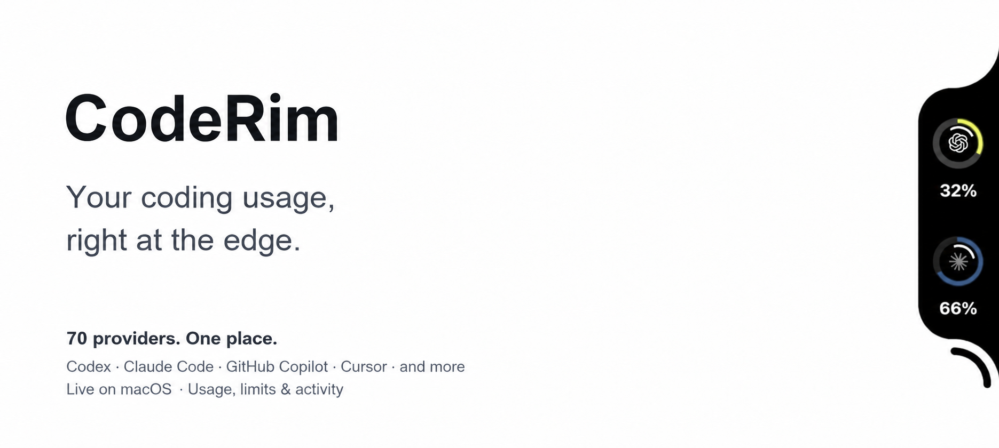

# CodeRim

[English](README.md) · **한국어**

> 화면 가장자리에서 확인하는 코딩 도우미 사용 한도.

[](https://github.com/dlfkdLR/CodeRim/actions/workflows/ci.yml) [](https://github.com/dlfkdLR/CodeRim/releases/latest) [](https://github.com/dlfkdLR/CodeRim/actions/workflows/windows.yml)  



CodeRim은 화면 가장자리의 작은 노치에 코딩 도우미의 사용 한도, 초기화 시간, 세션 활동을 표시합니다. **macOS 네이티브 앱**과 **Windows 11 구현 프리뷰**를 제공하며, Codex와 Claude Code의 로컬 토큰 사용 기록도 확인할 수 있습니다. Windows 프리뷰는 아직 macOS의 모든 기능을 지원하지는 않습니다.

## 플랫폼별 기능

| 기능 | macOS | Windows 프리뷰 |
| --- | --- | --- |
| 제공업체 연결 | 70개 제공업체 | 70개 연결 구현 |
| 데스크톱 화면 | 메뉴 막대, 설정, 화면 가장자리 노치 | 트레이, 동일한 설정 분류, 화면 가장자리 노치 |
| Codex / Claude 로컬 기록 | 토큰 사용 기록, 차트, 예상 비용 | 토큰 사용 기록, 차트, 예상 비용 |
| 터미널 CLI | 포함 | 포함 |
| 저장된 계정 전환 | Codex와 Claude Code | Codex와 Claude Code |
| 위젯 | macOS 위젯 | Windows 작업 범위 제외 |
| 업데이트 | 서명된 Sparkle 업데이트 | 새 릴리스 확인, ZIP 직접 설치 |

위 표는 현재 소스 기준입니다. 로컬 토큰 기록은 계정 구분 없이 이 컴퓨터에서 사용한 기록입니다. 제공업체별 Windows 지원 상태와 남은 작업은 [기능 현황표](Documentation/WINDOWS.md#remaining-parity-work)를 참고하세요.

두 앱은 여섯 가지 설정 분류와 Usage·Projects·Sessions·계정 탐색 구조를 공유합니다. Windows도 시스템 밝은/어두운 테마, 고대비, 수동 새로고침, 한도 표시 설정, 세션 이미지 개수와 직속 하위 에이전트 탐색을 지원합니다. 이미지 원본과 대화 내용은 사용량 DB에 복사하지 않습니다. Windows에는 지원 제공업체의 Firefox 로그인 가져오기, 서로 분리된 Amp API·CLI·Web 연결, Windsurf 로컬 캐시와 Antigravity OAuth·Local IDE 소스 선택, 갱신을 지원하는 Groq 콘솔 세션과 30일 사용 이력, 인증부터 청구 조회까지 일관된 재시도를 적용한 Factory 브라우저 세션과 계정 변경 충돌을 방지하는 WorkOS 세션 자동 갱신, Today·7D·30D 분석과 별도의 Codex·Claude 활동 감지도 구현되어 있습니다. 운영체제별 인증과 업데이트 방식에는 차이가 있으며, 아래 안내에서 구분합니다.

Windows 인증은 GitHub CLI, 신뢰할 수 있는 GLM Coding Plan과 Codebuff 로컬 로그인도 재사용합니다. Moonshot 지역별 키와 DeepSeek API·Web 인증 정보는 분리하고, Kimi API·CLI·Web 연결도 지원합니다. DeepSeek Web에서는 같은 세션의 상세 사용량 조회를 선택할 수 있습니다. StepFun에는 비밀번호 로그인과 Oasis-Token 갱신을 추가했습니다. MiniMax는 지역별 API·Web 연결을 분리합니다. Alibaba Token Plan은 소스와 지역을 선택해 Bailian CLI 또는 Web으로 연결할 수 있습니다. Firefox 가져오기는 선택한 프로필의 MiMo 세션 쿠키 복구와 Abacus·LongCat·Alibaba/Qwen Token Plan을 포함한 20개 연결 경로를 지원합니다. 연결 코드는 합성 응답으로 검사했으며, 실제 계정 인증 결과와는 구분합니다.

현재 소스는 공급자가 많을 때 노치 목록을 화면 크기에 맞춰 나누고, 긴 상세 카드는 스크롤로 표시합니다. xAI·Poe는 두 플랫폼이 인증 오류와 불완전한 이력을 같은 방식으로 처리합니다. 이 변경은 아래 릴리스 다운로드에 아직 포함되지 않은 감사 중인 수정입니다. [2026-09-20 감사 결과와 검증 범위](Documentation/FULL_AUDIT_2026-09-20.md)를 참고하세요.

## 설치

**macOS:** [2.1.7](https://github.com/dlfkdLR/CodeRim/releases/tag/v2.1.7) · **Windows:** [2.1.7](https://github.com/dlfkdLR/CodeRim/releases/tag/v2.1.7)

### macOS

**macOS 14 이상 · Apple Silicon 및 Intel 지원.**

[](https://github.com/dlfkdLR/CodeRim/releases/download/v2.1.7/CodeRim-2.1.7.dmg)

```sh
brew tap dlfkdLR/tap &&
brew install --cask dlfkdLR/tap/coderim
```

이 앱은 **임시 서명(ad-hoc)되어 있으며, Apple 공증은 받지 않았습니다**. 체크섬 검증, macOS 실행 허용, CodexMeter에서의 이전 방법은 [설치 및 첫 실행 안내](docs/installation.md)를 참고하세요.

Homebrew에서 cask를 사용할 수 없다는 메시지가 표시되거나 이전 `CodexMeter.app`을 찾지 못하면 [설치 문제 해결 안내](docs/troubleshooting.md#homebrew-cannot-find-the-coderim-cask)를 따르세요.

**Settings → Providers → Add Provider**를 열어 사용하는 도구를 연결한 뒤, 링 위에 마우스 포인터를 올려보세요. [시작하기](docs/getting-started.md).

### Windows 프리뷰

**Windows 11 · x64 및 ARM64 · .NET 포함.**

[x64 ZIP 다운로드](https://github.com/dlfkdLR/CodeRim/releases/download/v2.1.7/CodeRim-Windows-2.1.7-x64.zip) · [ARM64 ZIP 다운로드](https://github.com/dlfkdLR/CodeRim/releases/download/v2.1.7/CodeRim-Windows-2.1.7-arm64.zip) · [SHA-256 체크섬](https://github.com/dlfkdLR/CodeRim/releases/download/v2.1.7/SHA256SUMS-windows.txt)

Windows 실행 파일은 **서명되지 않았습니다**. 압축을 풀기 전에 ZIP의 체크섬을 확인하세요. 계속 사용할 폴더에 압축을 풀고 `CodeRim.exe`를 실행하거나, CodeRim을 종료한 뒤 압축을 푼 폴더의 PowerShell에서 다음 명령으로 현재 사용자용 설치를 진행하세요.

```powershell
./install.ps1 -AddCliToPath -Launch
```

설치기는 관리자 권한 없이 시작 메뉴 바로가기를 만들고 `coderim` CLI를 사용자 PATH에 추가합니다. 설치 후 새 터미널을 여세요. 제공업체는 **Settings → Providers**에서 연결하며, Codex·Claude Code 연결 방법과 남은 제한 사항은 [Windows 설치 및 기능 안내](Documentation/WINDOWS.md)를 참고하세요.

## macOS 지원 제공업체

macOS 목록에는 **70개 제공업체**가 있으며, 각각의 설정 안내를 제공합니다. Windows에서 실제로 연결할 수 있는 제공업체는 별도의 [기능 현황표](Documentation/WINDOWS.md#remaining-parity-work)에서 확인하세요. [전체 목록 및 연결 방법](docs/providers.md).

- [Codex](docs/providers/codex.md) — 계정 사용 한도와 로컬 토큰 사용 기록.
- [OpenAI](docs/providers/openai.md) — API 사용량, 지출, 사용 가능한 크레딧.
- [Azure OpenAI](docs/providers/azureopenai.md) — 계정 할당량이 아닌 엔드포인트 및 배포 상태 확인.
- [Claude Code](docs/providers/claude.md) — 로컬 토큰 사용 기록과 상태 표시줄을 통한 사용 한도.
- [ClinePass](docs/providers/clinepass.md) — 5시간, 주간, 월간 사용 한도.
- [Cursor](docs/providers/cursor.md) — 에디터 또는 Cursor Agent에서 가져오는 요금제 사용량.
- [OpenCode Zen](docs/providers/opencode-zen.md) — Zen 워크스페이스 구독 사용량.
- [OpenCode Go](docs/providers/opencode.md) — OpenCode 로그인 정보를 통해 확인하는 Go 요금제 사용량.
- [Alibaba Coding Plan](docs/providers/alibaba.md) — Alibaba Coding Plan 할당량.
- [Alibaba Token Plan](docs/providers/alibabatokenplan.md) — Bailian 토큰 요금제 사용량.
- [Qwen Cloud](docs/providers/qwencloud.md) — Individual Token Plan 사용 한도.
- [Droid / Factory](docs/providers/factory.md) — Factory 사용량 및 청구 정보.
- [Fireworks](docs/providers/fireworks.md) — 최근 30일간 계정 지출.
- [Gemini CLI](docs/providers/gemini-cli.md) — Gemini CLI 인증 정보를 통해 확인하는 할당량.
- [Antigravity](docs/providers/gemini.md) — 로컬 언어 서버에서 가져오는 모델별 허용 사용량.
- [GitHub Copilot](docs/providers/copilot.md) — GitHub CLI 로그인 정보를 통해 확인하는 Copilot 할당량.
- [Devin](docs/providers/devin.md) — 계정의 기간별 할당량.
- [GLM / Z.ai](docs/providers/glm.md) — Z.ai Coding Plan 사용량.
- [MiniMax](docs/providers/minimax.md) — Coding Plan 사용량.
- [Manus](docs/providers/manus.md) — 크레딧 잔액과 일일 허용 사용량.
- [Kimi Code](docs/providers/kimi.md) — Kimi Code 할당량과 요청 빈도 제한.
- [Kilo](docs/providers/kilo.md) — Kilo Pass 사용량.
- [Kiro](docs/providers/kiro.md) — CLI 사용량과 월간 크레딧.
- [Vertex AI](docs/providers/vertexai.md) — Google Cloud 할당량 사용 현황.
- [Augment](docs/providers/augment.md) — 계정 크레딧.
- [JetBrains AI](docs/providers/jetbrains.md) — 설치된 JetBrains IDE에서 확인할 수 있는 할당량 정보.
- [Moonshot / Kimi Open Platform](docs/providers/moonshot.md) — Kimi Open Platform API 잔액.
- [Amp](docs/providers/amp.md) — CLI 사용량과 계정 크레딧.
- [T3 Chat](docs/providers/t3chat.md) — 채팅 허용 사용량.
- [Ollama Cloud](docs/providers/ollama.md) — API 키를 통해 확인하는 클라우드 사용량.
- [Ollama Local](docs/providers/ollama-local.md) — 로드된 모델과 로컬 메모리 사용량.
- [Synthetic](docs/providers/synthetic.md) — API의 기간별 할당량.
- [OpenRouter](docs/providers/openrouter.md) — 크레딧 잔액과 지출.
- [ElevenLabs](docs/providers/elevenlabs.md) — 구독 크레딧과 사용량.
- [Warp](docs/providers/warp.md) — 요청 한도와 크레딧.
- [Windsurf](docs/providers/windsurf.md) — 에디터 또는 브라우저 세션에서 가져오는 요금제 사용량.
- [Zed](docs/providers/zed.md) — 에디터 요금제와 허용 사용량.
- [Perplexity](docs/providers/perplexity.md) — 계정 사용 크레딧.
- [Xiaomi MiMo](docs/providers/mimo.md) — 계정 잔액과 토큰 요금제 사용량.
- [Doubao](docs/providers/doubao.md) — Ark 요금제 사용량과 요청 한도 확인.
- [Sakana AI](docs/providers/sakana.md) — 기간별 할당량과 사용 가능한 크레딧.
- [Abacus AI](docs/providers/abacus.md) — ChatLLM 및 RouteLLM 연산 크레딧.
- [Mistral](docs/providers/mistral.md) — API 지출과 요금제별 허용 사용량.
- [DeepSeek](docs/providers/deepseek.md) — API 크레딧 잔액.
- [DeepInfra](docs/providers/deepinfra.md) — 잔액, 지출, 설정된 한도.
- [Codebuff](docs/providers/codebuff.md) — 크레딧과 주간 사용 한도.
- [Crof](docs/providers/crof.md) — 크레딧 잔액과 사용 가능한 요청 할당량.
- [Venice](docs/providers/venice.md) — DIEM 및 USD 잔액.
- [Command Code](docs/providers/commandcode.md) — 계정 크레딧 사용량.
- [Qoder](docs/providers/qoder.md) — 모델 크레딧 사용량.
- [StepFun](docs/providers/stepfun.md) — Step Plan 사용 한도.
- [AWS Bedrock](docs/providers/bedrock.md) — AWS 지출과 예산.
- [Grok](docs/providers/grok.md) — Grok CLI를 통해 확인하는 크레딧과 사용량.
- [Groq / GroqCloud](docs/providers/groq.md) — 콘솔 사용량과 지출.
- [LLM Proxy](docs/providers/llmproxy.md) — 프록시 할당량과 사용량.
- [LiteLLM](docs/providers/litellm.md) — 키별 및 팀별 지출 예산.
- [Deepgram](docs/providers/deepgram.md) — 음성 및 API 사용량 지표.
- [Poe](docs/providers/poe.md) — 포인트 잔액과 사용 기록.
- [Chutes](docs/providers/chutes.md) — 구독 사용량과 기간별 할당량.
- [Neuralwatt](docs/providers/neuralwatt.md) — API 할당량 사용 현황.
- [ClawRouter](docs/providers/clawrouter.md) — 라우터 지출과 월간 예산.
- [LongCat](docs/providers/longcat.md) — 계정의 기간별 할당량.
- [sub2api](docs/providers/sub2api.md) — 게이트웨이 할당량과 지갑 잔액.
- [Wayfinder](docs/providers/wayfinder.md) — 로컬 게이트웨이 상태와 경로 통계.
- [ZenMux](docs/providers/zenmux.md) — 기간별 할당량과 선불 잔액.
- [ai&](docs/providers/aiand.md) — 최근 30일간 지출.
- [ZoomMate](docs/providers/zoommate.md) — 크레딧 사용량.
- [xAI](docs/providers/xai.md) — 팀 잔액과 API 지출.
- [Notion AI](docs/providers/notion.md) — AI 허용 사용량.
- [IBM Bob](docs/providers/ibmbob.md) — Bobcoin 사용량.

## 문서

[macOS 설치](docs/installation.md) · [Windows 설치](Documentation/WINDOWS.md) · [시작하기](docs/getting-started.md) · [제공업체](docs/providers.md) · [토큰 사용 기록](docs/usage.md) · [계정](docs/accounts.md) · [CLI](docs/cli.md) · [위젯](docs/widgets.md) · [개인정보 보호](docs/privacy.md) · [문제 해결](docs/troubleshooting.md)

[전체 문서](docs/README.md) · [변경 이력](CHANGELOG.md) · [보안](SECURITY.md)

## 크레딧 및 라이선스

[MIT](LICENSE). 화면 가장자리의 노치 인터페이스와 관련 코드에는 [Codenotch](https://github.com/vinzdg/codenotch)의 일부 코드가 포함되어 있으며, 해당 부분에는 **MIT © 2026 Vinz**가 적용됩니다. 제공업체 연동에는 [CodexBar](https://github.com/steipete/CodexBar)를, 업데이트에는 [Sparkle](https://sparkle-project.org/)을 사용합니다. 재배포 시 [LICENSE](LICENSE)와 [NOTICE](NOTICE)를 보존해야 합니다.

CodeRim은 비공식 유틸리티로, OpenAI 또는 Anthropic과 제휴 관계가 없으며 두 회사의 보증을 받지 않습니다.
