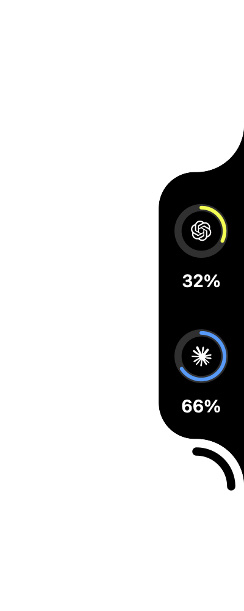

<div align="center">


[](https://github.com/dlfkdLR/CodeRim/actions/workflows/ci.yml) [](https://github.com/dlfkdLR/CodeRim/releases/latest) 

**Coding-assistant limits at the edge of your screen. Local token history one click away.**

<sub>70 supported providers, including Codex, Claude Code, GitHub Copilot, and Cursor. The example rings show remaining usage.</sub>

</div>

CodeRim is a native macOS app that puts your coding assistants' usage limits in a small edge notch. Hover a ring for its limit windows, reset times, account plan, and active sessions. Open **Settings → Usage** for Codex and Claude Code token history, charts, projects, and sessions.

## Download

[](https://github.com/dlfkdLR/CodeRim/releases/download/v2.1.0/CodeRim-2.1.0.dmg)

**macOS 14 or later · Apple silicon and Intel.** [Release notes and all downloads](https://github.com/dlfkdLR/CodeRim/releases/latest).

### Homebrew

```sh
brew install --cask dlfkdLR/tap/coderim
```

To update an existing CodeRim installation:

```sh
brew update
brew upgrade --cask --greedy dlfkdLR/tap/coderim
```

Existing CodexMeter Homebrew users can move to the new cask:

```sh
brew update
brew migrate --cask dlfkdLR/tap/codexmeter
brew upgrade --cask --greedy dlfkdLR/tap/coderim
```

Settings, usage history and saved accounts are retained. [Name transition details](Documentation/REBRANDING.md).

### First launch

The app is **ad-hoc signed, not Apple-notarized**. Homebrew verifies the ZIP checksum. For a direct download, save the DMG and [SHA256SUMS.txt](https://github.com/dlfkdLR/CodeRim/releases/download/v2.1.0/SHA256SUMS.txt) in the same folder and verify before opening:

```sh
cd ~/Downloads
grep ' CodeRim-2.1.0.dmg$' SHA256SUMS.txt | shasum -a 256 -c -
open CodeRim-2.1.0.dmg
```

After the checksum reports `OK`, drag CodeRim to Applications. If macOS blocks the verified app, remove quarantine from **CodeRim only**, then launch it:

```sh
xattr -dr com.apple.quarantine /Applications/CodeRim.app
open /Applications/CodeRim.app
```

This also applies after a verified Homebrew install. Later automatic updates are authenticated with Sparkle Ed25519 signatures.

## At the edge

- **Used or remaining.** Choose what the percentage and ring mean in **Settings → Notch → Readings**. Warning colours continue to track consumption.
- **Account and plan.** Hover for the account plan, including Codex Pro 5x/20x and Claude Max 5x/20x when the account reports the tier.
- **Working, waiting, finished.** Session activity animates the rings. Optional completion peeks and sounds let you know when to return to a task.
- **Quick controls.** Hover the arc to reveal Settings and account switching above or below the notch. The account popover shows provider logos, current accounts, and plans.
- **Your layout.** Use any screen edge, choose the size and ring colour, and Option-drag to reposition. The notch starts enabled and remembers your choices.

<p align="center">
  
</p>

The small menu-bar item opens Usage, Settings, updates, or the notch when hidden.

## CLI and widgets

The app includes a `coderim` CLI with aligned usage bars, remaining percentages, reset countdowns and JSON output for all **70 providers**. Install it from **Settings → Diagnostics → Install CLI**, then run `coderim` or `coderim usage --provider all --json`.

Native **Usage**, **History**, **Metric** and **Overview** widgets offer compact quotas, daily charts and single-value readings. Add them from macOS **Edit Widgets**, choose a provider, and select the supported small, medium or large size. Local token history and estimated API costs are available for Codex and Claude.

CLI and widgets share the app's latest snapshot, with explicit stale, disabled and unavailable states. Keep CodeRim running for fresh readings. [Setup, commands and widget guide](Documentation/CLI_WIDGETS.md).

## Providers

Open **Settings → Providers → Add Provider** to browse the searchable catalogue. Add several tools without closing it; drag their rows to reorder the rings. Removing a provider stops its monitoring and leaves its original app signed in.

| Provider | What CodeRim reads |
| --- | --- |
| **Codex** | Local session token history and read-only limits from the signed Codex app-server. Optional ChatGPT account history is shown separately with its server snapshot date. |
| **Claude Code** | Local session token history. After account setup, Claude Code's status-line integration supplies five-hour and weekly limits. |
| **GitHub Copilot** | Copilot quotas using the GitHub CLI's existing sign-in. |
| **Cursor** | Usage limits from the Cursor editor or Cursor Agent sign-in. |
| **Grok** | Credits and usage from the Grok CLI sign-in. |
| **OpenCode** | Go-plan usage from the existing OpenCode sign-in. |
| **Command Code** | Credits from the Command Code account. |
| **GLM** | Coding Plan usage with the key already configured in a supported coding tool. |
| **Ollama Cloud** | Cloud usage with an API key supplied in Settings. |
| **Antigravity** | Model allowances from its local language server. |
| **Ollama Local** | Models loaded in the local Ollama runtime and their memory use. |

Most integrations use the session already owned by the original tool. Adding a provider to the catalogue does not sign you into that tool. Data availability depends on the provider and the account's permissions.

For Claude Code, sign in through `claude`, then open **Settings → Providers → Claude Code Details**, enable the integration, and add the account. Limits appear after Claude Code completes a response. See [Claude Code setup](Documentation/CLAUDE.md).

## Token history

**Settings → Usage** keeps Codex and Claude Code histories separate. See today's input, cached input, and output; explore daily charts, models, projects, sessions, and supported cost estimates.

**General → Number format** applies Compact or Detailed formatting to Usage and the notch's token/count readings. **Today** and **History · This Mac** show one set of live local totals: this week, this month, and Local History. New session records update these totals together. Local history spans accounts on this Mac; switching accounts does not reset it or add a server account total. Delayed ChatGPT profile statistics are not displayed or fetched by the live usage interface.

For Codex, cached input is already part of input: **Total = Input + Output**. [How accounting and data sources work](Documentation/USAGE.md).

## Accounts

Use the notch's account control or **Settings → Usage → Switch** to manage saved Codex accounts. Logins are saved in this Mac's Keychain, and switching asks before restarting Codex. There is no automatic quota-based account rotation.

Claude’s account entry opens **Claude Accounts**, with the same saved-account list, Add Account, Switch, and removal actions. Browser sign-in uses an isolated official Claude CLI configuration; close Claude Code sessions before switching. [Account setup and limitations](Documentation/ACCOUNTS.md).

## Alerts and updates

A provider can notify you when a limit crosses 80% or 100%. Enable alerts in **Settings → Notch**, or mute one provider from its row in **Providers**. Session-end peeks and sounds have their own controls.

Sparkle checks the signed update feed daily. Change automatic checks in **Settings → General**, or choose **Check for Updates** from the menu-bar item.

## Privacy and accuracy

Local token accounting runs on this Mac. CodeRim does not put prompts, responses, source code, full project paths, or attachment contents in its usage database. Credentials do not enter that database or diagnostics; explicitly saved Codex and Claude accounts use separate local Keychain items.

Provider limit requests go to their respective services; optional ChatGPT account totals require the existing Codex sign-in. Internal provider endpoints can change. Missing or stale readings are labelled rather than invented, and deleted local logs cannot be reconstructed. API-equivalent cost estimates are not subscription charges or bills.

[Privacy details](Documentation/PRIVACY.md) · [Accounting and limitations](Documentation/USAGE.md) · [Troubleshooting](Documentation/TROUBLESHOOTING.md)

## Building

Use Xcode with Swift 6.2 or later:

```sh
git clone https://github.com/dlfkdLR/CodeRim.git
cd CodeRim
swift test
swift run CodeRim
```

Build a Universal app, ZIP, DMG, and checksums without an Apple signing certificate:

```sh
Scripts/release_unsigned.sh
```

Maintainer signing and publication steps are in [Releasing](Documentation/RELEASING.md). See also [Architecture](Documentation/ARCHITECTURE.md), [Contributing](CONTRIBUTING.md), [Security](SECURITY.md), and the [Changelog](CHANGELOG.md).

## Credits and license

The edge-notch interface, provider integrations, and supporting code are adapted from [Codenotch](https://github.com/vinzdg/codenotch) by Vinz. This README follows its product-first presentation; the product photograph is a capture of **CodeRim itself**. Automatic updates use [Sparkle](https://sparkle-project.org/).

[MIT](LICENSE) © CodeRim contributors. Incorporated Codenotch portions remain **MIT © 2026 Vinz**. The full original copyright and license are preserved in [NOTICE](NOTICE), bundled with the app, and available in **Settings → Information**. Preserve both files when redistributing.

CodeRim is an unofficial utility, not affiliated with or endorsed by OpenAI or Anthropic.
