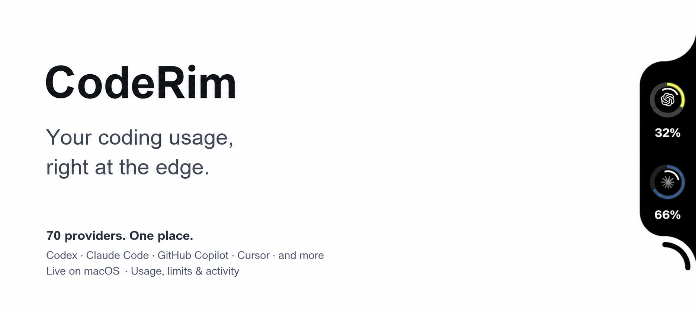

# CodeRim

**English** · [한국어](README.ko.md)

> Coding-assistant limits at the edge of your screen.

[](https://github.com/dlfkdLR/CodeRim/actions/workflows/ci.yml) [](https://github.com/dlfkdLR/CodeRim/releases/latest) [](https://github.com/dlfkdLR/CodeRim/actions/workflows/windows.yml)



CodeRim keeps coding-assistant usage limits, reset times, and session activity visible in a small edge notch. It is a native **macOS app** and a **Windows 11 app**, with separate local token history for Codex and Claude Code.

## Features by platform

| Feature | macOS | Windows |
| --- | --- | --- |
| Provider catalogue | 70 setup guides | 70 connection implementations; see the capability matrix |
| Desktop interface | Menu bar, Settings, edge notch | Tray, Settings, edge notch |
| Local Codex / Claude history | Tokens, models, projects, sessions; Codex cost estimates | Local history and analytics; platform-specific estimates |
| Terminal CLI | Included | Included |
| Saved accounts | Manual Codex and Claude Code switching | Manual Codex and Claude Code switching |
| Widgets | macOS widgets | Outside the Windows scope |
| Updates | Ed25519-validated Sparkle updates | Verified MSI updates for managed installs; separate legacy ZIP path |

Local counts cover records on **this computer across accounts**. Cached input is already part of input. Missing or remote-only session records stay unavailable. Quotas, local tokens, account totals, and API-equivalent cost estimates have separate sources. [Usage scope](docs/usage.md) explains those boundaries. Optional [iPhone sharing](docs/iphone.md) has separate device, signing, relay, and APNs requirements.

## Install

**macOS:** [2.1.15](https://github.com/dlfkdLR/CodeRim/releases/tag/v2.1.15) · **Windows:** [2.1.17](https://github.com/dlfkdLR/CodeRim/releases/tag/v2.1.17)

### macOS

**macOS 14 or later · Apple silicon and Intel.**

[](https://github.com/dlfkdLR/CodeRim/releases/download/v2.1.15/CodeRim-2.1.15.dmg)

```sh
brew tap dlfkdLR/tap &&
brew install --cask dlfkdLR/tap/coderim
```

The app is **ad-hoc signed, not Apple-notarized**. See [installation and first launch](docs/installation.md) for checksums, macOS approval, and CodexMeter migration. If Homebrew cannot find the cask or old app, use the [repair guide](docs/troubleshooting.md#homebrew-cannot-find-the-coderim-cask).

Open **Settings → Providers → Add Provider**, connect your tools, then hover a ring. [Get started](docs/getting-started.md).

### Windows

**Windows 11 · x64 and ARM64 · .NET included.**

[](https://github.com/dlfkdLR/CodeRim/releases/download/v2.1.17/CodeRim-Windows-2.1.17-x64-Setup.msi) [](https://github.com/dlfkdLR/CodeRim/releases/download/v2.1.17/CodeRim-Windows-2.1.17-arm64-Setup.msi)

Run the MSI and open CodeRim from the Start menu. It installs for your account without administrator access, adds the `coderim` command, and updates itself after verifying each release ([x64 SHA-256](https://github.com/dlfkdLR/CodeRim/releases/download/v2.1.17/CodeRim-Windows-2.1.17-x64-Setup.msi.sha256) · [ARM64 SHA-256](https://github.com/dlfkdLR/CodeRim/releases/download/v2.1.17/CodeRim-Windows-2.1.17-arm64-Setup.msi.sha256)).

The MSI is not yet signed by a publisher certificate, so Windows may say **Windows protected your PC**: choose **More info → Run anyway**. A Microsoft-signed Microsoft Store version, which also installs where Smart App Control blocks unsigned installers, is on its way. [Windows installation](docs/windows.md) covers upgrades, CLI setup and the Store version.

Open **Settings → Providers → Add Provider**, sign in once, then hover a ring.

## macOS providers

**70 providers**, each with a setup guide. [Full catalogue](docs/providers.md) · [Windows capability matrix](Documentation/WINDOWS.md#remaining-parity-work).

- [Codex](docs/providers/codex.md) — Account limits and local token history.
- [OpenAI](docs/providers/openai.md) — API usage, spending, and available credits.
- [Azure OpenAI](docs/providers/azureopenai.md) — Endpoint and deployment checks, not account quotas.
- [Claude Code](docs/providers/claude.md) — Local token history and status-line usage limits.
- [ClinePass](docs/providers/clinepass.md) — Five-hour, weekly, and monthly limits.
- [Cursor](docs/providers/cursor.md) — Plan usage from the editor or Cursor Agent.
- [OpenCode Zen](docs/providers/opencode-zen.md) — Zen workspace subscription usage.
- [OpenCode Go](docs/providers/opencode.md) — Go-plan usage from your OpenCode sign-in.
- [Alibaba Coding Plan](docs/providers/alibaba.md) — Alibaba Coding Plan quotas.
- [Alibaba Token Plan](docs/providers/alibabatokenplan.md) — Bailian token-plan usage.
- [Qwen Cloud](docs/providers/qwencloud.md) — Individual Token Plan limits.
- [Droid / Factory](docs/providers/factory.md) — Factory usage and billing.
- [Fireworks](docs/providers/fireworks.md) — Account spending over the past 30 days.
- [Gemini CLI](docs/providers/gemini-cli.md) — Quotas through Gemini CLI credentials.
- [Antigravity](docs/providers/gemini.md) — Model allowances from the local language server.
- [GitHub Copilot](docs/providers/copilot.md) — Copilot quotas from your GitHub CLI sign-in.
- [Devin](docs/providers/devin.md) — Account quota windows.
- [GLM / Z.ai](docs/providers/glm.md) — Z.ai Coding Plan usage.
- [MiniMax](docs/providers/minimax.md) — Coding Plan usage.
- [Manus](docs/providers/manus.md) — Credit balance and daily allowances.
- [Kimi Code](docs/providers/kimi.md) — Kimi Code quotas and rate limits.
- [Kilo](docs/providers/kilo.md) — Kilo Pass usage.
- [Kiro](docs/providers/kiro.md) — CLI usage and monthly credits.
- [Vertex AI](docs/providers/vertexai.md) — Google Cloud quota usage.
- [Augment](docs/providers/augment.md) — Account credits.
- [JetBrains AI](docs/providers/jetbrains.md) — Available quota data from installed JetBrains IDEs.
- [Moonshot / Kimi Open Platform](docs/providers/moonshot.md) — Kimi Open Platform API balance.
- [Amp](docs/providers/amp.md) — CLI usage and account credits.
- [T3 Chat](docs/providers/t3chat.md) — Chat usage allowances.
- [Ollama Cloud](docs/providers/ollama.md) — Cloud usage with an API key.
- [Ollama Local](docs/providers/ollama-local.md) — Loaded models and local memory usage.
- [Synthetic](docs/providers/synthetic.md) — API quota windows.
- [OpenRouter](docs/providers/openrouter.md) — Credit balance and spending.
- [ElevenLabs](docs/providers/elevenlabs.md) — Subscription credits and usage.
- [Warp](docs/providers/warp.md) — Request limits and credits.
- [Windsurf](docs/providers/windsurf.md) — Plan usage from editor or browser sessions.
- [Zed](docs/providers/zed.md) — Editor plan and usage allowances.
- [Perplexity](docs/providers/perplexity.md) — Account usage credits.
- [Xiaomi MiMo](docs/providers/mimo.md) — Account balance and token-plan usage.
- [Doubao](docs/providers/doubao.md) — Ark plan usage and request-limit checks.
- [Sakana AI](docs/providers/sakana.md) — Quota windows and available credits.
- [Abacus AI](docs/providers/abacus.md) — ChatLLM and RouteLLM compute credits.
- [Mistral](docs/providers/mistral.md) — API spending and plan allowances.
- [DeepSeek](docs/providers/deepseek.md) — API credit balance.
- [DeepInfra](docs/providers/deepinfra.md) — Balance, spending, and configured limits.
- [Codebuff](docs/providers/codebuff.md) — Credits and weekly limits.
- [Crof](docs/providers/crof.md) — Credit balance and available request quotas.
- [Venice](docs/providers/venice.md) — DIEM and USD balances.
- [Command Code](docs/providers/commandcode.md) — Account credit usage.
- [Qoder](docs/providers/qoder.md) — Model credit usage.
- [StepFun](docs/providers/stepfun.md) — Step Plan limits.
- [AWS Bedrock](docs/providers/bedrock.md) — AWS spending and budgets.
- [Grok](docs/providers/grok.md) — Credits and usage through Grok CLI.
- [Groq / GroqCloud](docs/providers/groq.md) — Console usage and spending.
- [LLM Proxy](docs/providers/llmproxy.md) — Proxy quotas and usage.
- [LiteLLM](docs/providers/litellm.md) — Key and team spending budgets.
- [Deepgram](docs/providers/deepgram.md) — Speech and API usage metrics.
- [Poe](docs/providers/poe.md) — Point balance and usage history.
- [Chutes](docs/providers/chutes.md) — Subscription usage and quota windows.
- [Neuralwatt](docs/providers/neuralwatt.md) — API quota usage.
- [ClawRouter](docs/providers/clawrouter.md) — Router spending and monthly budgets.
- [LongCat](docs/providers/longcat.md) — Account quota windows.
- [sub2api](docs/providers/sub2api.md) — Gateway quotas and wallet balance.
- [Wayfinder](docs/providers/wayfinder.md) — Local gateway health and route statistics.
- [ZenMux](docs/providers/zenmux.md) — Quota windows and prepaid balance.
- [ai&](docs/providers/aiand.md) — Spending over the past 30 days.
- [ZoomMate](docs/providers/zoommate.md) — Credit usage.
- [xAI](docs/providers/xai.md) — Team balance and API spending.
- [Notion AI](docs/providers/notion.md) — AI usage allowances.
- [IBM Bob](docs/providers/ibmbob.md) — Bobcoin usage.

## Docs

[User documentation](docs/README.md) · [Developer documentation](Documentation/README.md) · [Contributing](CONTRIBUTING.md) · [Changelog](CHANGELOG.md) · [Security](SECURITY.md)

For source builds, follow [Contributing](CONTRIBUTING.md) to prepare the pinned dependency fixes before running Swift tests. CI and release builds reject Swift compiler warnings.

## Credits and license


[MIT](LICENSE). The edge-notch interface and supporting code include portions from [Codenotch](https://github.com/vinzdg/codenotch), **MIT © 2026 Vinz**. Provider integrations use [CodexBar](https://github.com/steipete/CodexBar), and updates use [Sparkle](https://sparkle-project.org/). Preserve [LICENSE](LICENSE) and [NOTICE](NOTICE) when redistributing.

CodeRim is an unofficial utility, not affiliated with or endorsed by OpenAI or Anthropic.
